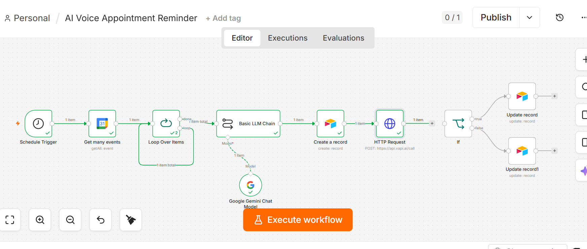
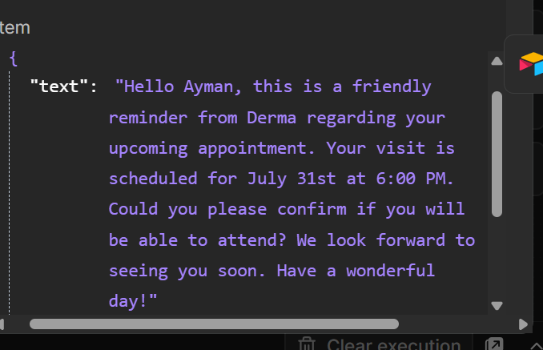
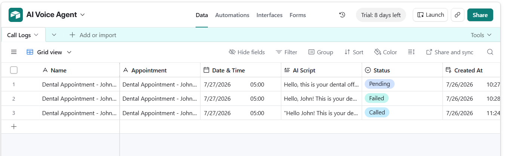
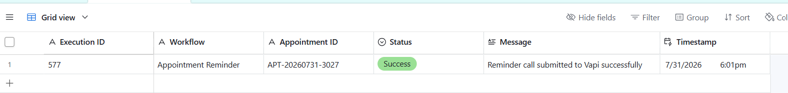

# 🤖 AI Voice Appointment Reminder System

An AI-powered appointment reminder workflow built with **n8n**, **Google Gemini**, **Google Calendar**, **Airtable**, and **Vapi**. The system automatically retrieves upcoming appointments, generates personalized reminder scripts using AI, stores appointment records, initiates AI voice calls, and tracks workflow execution for monitoring.

---

## 🚀 Features

- 📅 Automatically retrieves upcoming appointments from Google Calendar
- ✅ Validates and cleans appointment data
- 🆔 Generates a unique Appointment ID
- 🤖 Uses Google Gemini to generate personalized reminder scripts
- 📞 Initiates AI voice reminder calls using Vapi
- 🗂️ Stores appointment details in Airtable
- 📊 Tracks reminder status and call status
- 📝 Logs successful and failed workflow executions
- ⚡ Fully automated with scheduled execution

---

## 🏗️ Workflow Architecture

```text
Schedule Trigger
        │
        ▼
Get Today's Appointments
        │
        ▼
Validate Appointment Data
        │
        ▼
Clean Appointment Data
        │
        ▼
Generate Appointment ID
        │
        ▼
Generate AI Reminder Script (Gemini)
        │
        ▼
Save Appointment (Airtable)
        │
        ▼
Send AI Reminder Call (Vapi)
        │
        ▼
Call Submitted?
     ┌─────────────┐
     │             │
     ▼             ▼
Success         Failed
     │             │
Update        Update
Status        Status
     │             │
Log           Log
Success       Failure
```

---

## 🛠️ Tech Stack

- n8n
- Google Calendar API
- Google Gemini
- Airtable
- Vapi AI
- HTTP Request
- AI Automation
- REST APIs

---

## 📂 Airtable Structure

### Appointments Table

| Field |
|--------|
| Appointment ID |
| Appointment Title |
| Organizer Email |
| Appointment Date |
| Reminder Script |
| Status |
| Reminder Status |
| Call Status |
| Created At |
| Updated At |

### Workflow Executions Table

| Field |
|--------|
| Execution ID |
| Workflow |
| Appointment ID |
| Status |
| Message |
| Timestamp |

---

## 📸 Screenshots

### Workflow



```
screenshots/workflow.png
```

### AI Response



```
screenshots/ai.png
```

### Airtable






```
screenshots/airtable.png

screenshots/executions.png
```

---

## 🎥 Demo

A short demonstration showing:

- Scheduled workflow execution
- Google Calendar appointment retrieval
- AI reminder generation with Gemini
- Airtable record creation
- Vapi voice call request
- Status updates
- Workflow logging

---

## 💼 Business Use Cases

- Healthcare Clinics
- Dental Practices
- Consultants
- Coaching Businesses
- Salons & Spas
- Law Firms
- Financial Advisors
- Real Estate Agencies

---

## 🔮 Future Improvements

- SMS reminders
- Email reminders
- WhatsApp reminders
- Two-way appointment confirmation
- Automatic appointment cancellation handling
- Multi-language voice reminders
- Retry failed reminder calls
- Slack notifications for failed reminders

---

## 📁 Project Structure

```
ai-voice-appointment-reminder/
│
├── README.md
├── workflow.json
├── images/
│   ├── workflow.png
│   ├── appointments-table.png
│   └── workflow-executions.png
└── LICENSE
```

---

## 👨‍💻 Author

**Ayman Amjad**

Software Engineer | AI Automation Developer

Specializing in:

- AI Automation
- n8n Workflows
- AI Agents
- Voice AI
- Business Process Automation

---

## ⭐ If you found this project helpful, consider giving it a Star!
